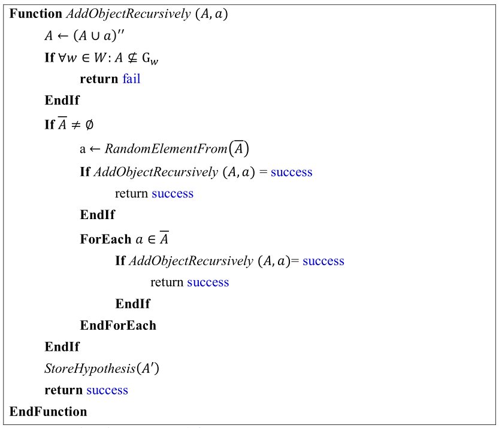
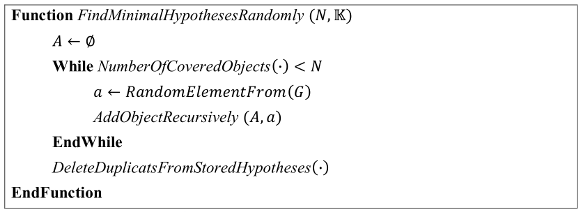

# Fast search of a covering set of minimal hypotheses

The necessity of construction of a set of minimal hypotheses for a formal context arises when solving a classification problem with the JSM-method or for the similar purposes. For example, the problem of construction of the implication base could also be reduced to this problem. One drawback of the algorithms of complete enumeration of the set of minimal hypotheses is their computational complexity. Thus this particular relaxation by limiting the scope of the search to a single incomplete covering set of hypotheses is an important algorithm for practical applications.

## Theoretical background
An excellent introduction to the theoretical perspective of the formalism upon which the algorithm works is given in [Kuznetsov, S.O., 2001] with examples where and how the hypotheses are used.

```
Kuznetsov, S. O. "Machine learning on the basis of formal concept analysis." Automation and Remote Control 62.10 (2001): 1543-1564.
```

Also the canonical Close-by-One algorithm on which the proposed algorithm builds on:

```
S.O.Kuznetsov, A fast algorithm for computing all intersections of objects from an arbitrary semilattice. Nauchno-Tekhnicheskaya Informatsiya Seriya 2 - Informatsionnye protsessy i sistemy, No. 1, pp.17-20, 1993.
```

### Algorithm's Pseudo-Code




## Authors

Dmitry Morozov - Implementation
Sergei. O. Kuznetsov - Scientific Mentoring


## License

This project is licensed under the MIT License - see the [LICENSE.md](LICENSE.md) file for details


## Useful Links

[Formal Concept Analysis Homepage](http://www.upriss.org.uk/fca/fca.html)
